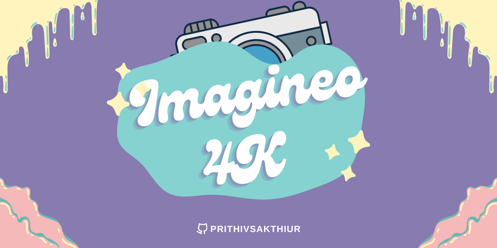
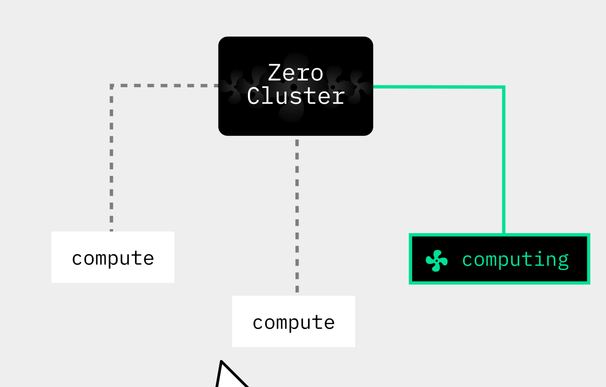

 
Check out the configuration reference at https://huggingface.co/docs/hub/spaces-config-reference

Spaces: https://huggingface.co/spaces/prithivMLmods/IMAGINEO-4K

Take Clone : 

    # Make sure you have git-lfs installed (https://git-lfs.com)
    git lfs install
    
    git clone https://huggingface.co/spaces/prithivMLmods/Midjourney
    
    # If you want to clone without large files - just their pointers
    
    GIT_LFS_SKIP_SMUDGE=1 git clone https://huggingface.co/spaces/prithivMLmods/Midjourney

## Sample Images 

|  |  |
|-------------------------|-------------------------|
|  |  |

## Requirements.txt

| torch     | diffusers | transformers | safetensors |
|-----------|-----------|--------------|-------------|
| accelerate| spaces    | peft         | pillow      |

## Requirements Zero

ZeroGPU is a new kind of hardware for Spaces.

It has two goals :

    Provide free GPU access for Spaces
    Allow Spaces to run on multiple GPUs

This is achieved by making Spaces efficiently hold and release GPUs as needed (as opposed to a classical GPU Space that holds exactly one GPU at any point in time)

ZeroGPU uses Nvidia A100 GPU devices under the hood (40GB of vRAM are available for each workloads)

## Compatibility

ZeroGPU Spaces should mostly be compatible with any PyTorch-based GPU Space.
Compatibility with high level HF libraries like transformers or diffusers is slightly more guaranteed
That said, ZeroGPU Spaces are not as broadly compatible as classical GPU Spaces and you might still encounter unexpected bugs

Also, for now, ZeroGPU Spaces only works with the Gradio SDK

Supported versions:

    Gradio: 4+
    PyTorch: All versions from 2.0.0 to 2.2.0
    Python: 3.10.13

## Usage

In order to make your Space work with ZeroGPU you need to decorate the Python functions that actually require a GPU with @spaces.GPU
During the time when a decorated function is invoked, the Space will be attributed a GPU, and it will release it upon completion of the function.
Here is a practical example :

    +import spaces
    from diffusers import DiffusionPipeline
    
    pipe = DiffusionPipeline.from_pretrained(...)
    pipe.to('cuda')
    
    +@spaces.GPU
    def generate(prompt):
        return pipe(prompt).images
    
    gr.Interface(
        fn=generate,
        inputs=gr.Text(),
        outputs=gr.Gallery(),
    ).launch()

   
We first import spaces (importing it first might prevent some issues but is not mandatory)
Then we decorate the generate function by adding a @spaces.GPU line before its definition

## Duration

If you expect your GPU function to take more than 60s then you need to specify a duration param in the decorator like:
    
    @spaces.GPU(duration=120)
    def generate(prompt):
       return pipe(prompt).images

It will set the maximum duration of your function call to 120s.

You can also specify a duration if you know that your function will take far less than the 60s default.

The lower the duration, the higher priority your Space visitors will have in the queue

.

.

.
@prithivmlmods

